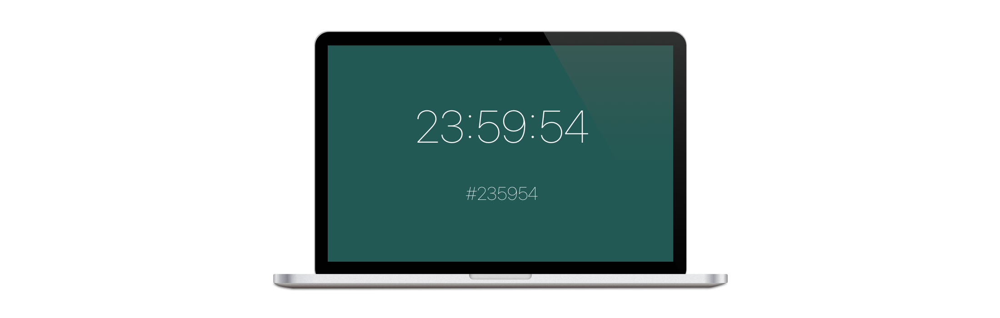

#  What Color Is It



With macOS Catilina the previous screen saver format has been replaced with a new extension based screen saver. These extensions can be bundled with apps, and are automatically recognized by the system one the app has been open. I converted one of my simplier screen savers to use the new app extension format. NOTE: The screen saver extensions are still private, I had to dump and import the private headers for the screen saver framework. You will need a developer account to build and sign the resulting app, the screen saver extension will not load unless the app is signed.

From what I tested, the screen saver extension works like other extensions in terms of capibilities. Everything you need just needs to be specified as an entitlement.

## Creating a Screen Saver Extension

**Step 1**

Add an extension target to your app, any extension will do. I created a *Quick Look Preview Extension*.

**Step 2**

Update the *Signing & Capabilites* of both the app and screen saver extension. The *App Sandbox* and *Hardend Runtime* entitlements of the both the app and extension must match.

- Make sure the *App Sandbox* entitlement exists.
- Make sure the *Hardened Runtime* entitlement exists and that *Apple Events* resource access is enabeld.
- I also added the app groups extension and was able to share a *UserDefaults* between both the app and screen saver extension. This let me configure the screen saver through both system preferences and the app.

**Step 3**

Modify the *Info.plist*:

- Change the *Bundle display name* and *Bundle name* to be the name you would like System Preferences to use for the screen saver.
- Change the *NSExtension/NSExtensionPointIdentifier* to *com.apple.screensaver*
    - This tells the system that this is a screen saver extension.
- Change the *NSExtension/NSExtensionPrincipalClass* to *$(PRODUCT_MODULE_NAME).WhatColorIsItController*
    - The class name used here is the subclass of *ScreenSaverExtension*. It just seem the class just needs to exist so that the extension can be registered. I haven't found any other use for it at this point.
- Change the *NSExtension/NSExtensionPointVersion* to *1.0*
    - This is copied from the screen saver extension provided with the system on macOS Mojave.
- Add the key *ScreenSaverConfigurationViewControllerClass* with a value of *$(PRODUCT_MODULE_NAME).WhatColorIsItConfigurationViewController*
    - This is the view controller class that manages the view that allows the user to configure your screen saver. *What Color Is It* only has two settings, so I opted to have the controls on the main system preferences screen. I have not tried adding a button to present a sheet like the other more complicated screen savers.
    - Note: Make sure to use a width of 298pts for your view. Currently the view doesn't auto resize, though autolayout does work inside of your view.
- Add the key *ScreenSaverConfigurationViewControllerClass* with a value of *$(PRODUCT_MODULE_NAME).WhatColorIsItViewController*
    - This view controller's sole responsibility is to load your screen saver view. I haven't found any other uses for it yet.
    
**Step 4**

Add the dumped private headers for the *ScreenSaver* framework and *NSServiceViewController* to the project. Then add a bridging header to access the private classes in Swift.

**Step 5**

Add the following classes:

A *ScreenSaverExtension* subclass:
```
import Foundation
import Cocoa
import ScreenSaver

/// The controller for the extension.
@objc public class WhatColorIsItController: ScreenSaverExtension {
    
}
```

A *ScreenSaverViewController* subclass that loads your screen saver view.
```
import Foundation
import Cocoa
import ScreenSaver

/// The view controller that displays the screen saver view.
@objc public class WhatColorIsItViewController: ScreenSaverViewController {
    
    public override func loadView() {
        view = WhatColorIsItView(frame: WhatColorIsItViewController.expectedViewFrame(), isPreview: false)!
    }
    
}
```

A *ScreenSaverConfigurationViewController* subclass and xib to house the controls that are shown in *System Preferences* 

Note: Since the view controller is a subclass of *NSServiceViewController*, you won't be able to load this view controller in the app. It will cause the window to refuse to load any content. You will have to recreate your configuration view controller, or use direct subclass of *NSViewController* and import that into both your app and extension.

```
import Foundation
import Cocoa
import ScreenSaver

/// The view controller that allows the user to configure the screen saver's settings.
class WhatColorIsItConfigurationViewController: ScreenSaverConfigurationViewController {
    
    override func nibName() -> Any! {
        return "WhatColorIsItConfigurationViewController"
    }
    
}
```

A *ScreenSaverExtensionView* subclass. This is the actual presented screen saver. I was unable to get the `animateOneFrame` method to work, even adding what seems to be the matching key to the Info.plist. But there are two new methods `startAnimation` and `stopAnimation` which are called when the screen saver is displayed and hidden. I just set up a timer to update the display once every second, I would just setup the display update method that works for you.
```
/// The primary view of the screen saver.
@objc public class WhatColorIsItView: ScreenSaverExtensionView, WhatColorIsItDefaultsDelegate {
    
    // MARK: - Properties
    
    /// The timer that updates the view.
    fileprivate var timer: Timer?
    
    // MARK: - Animation
    
    public override func startAnimation() {
        timer = Timer.scheduledTimer(withTimeInterval: 1.0, repeats: true, block: { [weak self] (_) in
            self?.setNeedsDisplay(self?.bounds ?? .zero)
        })
    }
    
    public override func stopAnimation() {
        timer = nil
    }
    
}
```

**Step 6**

There seems to be two ways to add a thumbnail for *System Preferences* to load.

The old way: You can add the standard *thumbnail.png* and *thumbnail@2x.png* directly to the project. If you do this, be sure to set *COMBINE_HIDPI_IMAGES* in the build settings for the extension  to *YES*.

The new way: You can add an asset catalog to the extension with a image resource named *thumbnail*. 

## Installing

Copy the app to your computer's *Applications* directory, and open it. You should now be able to open *System Preferences* and see your screen saver. \

If you're developing a screen saver, you won't be able to open the app from where Xcode places your build products. The system won't be able to open the extension from there. You will need to copy the app into the *Applications* directory.

## That's it

Be sure to look at the full project for a complete working setup. If there are any updates necessary, feel free to open a pull request. (There might be, I'm still running Mojave.)
