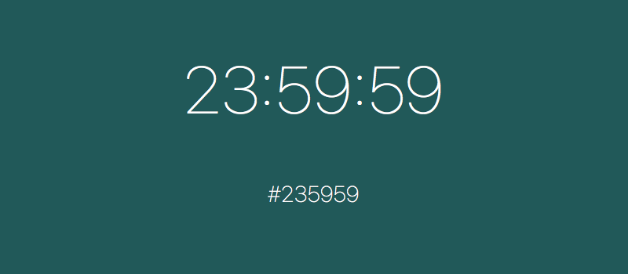

WhatColorIsIt
=============

A simple screensaver that displays the current time. The background color is the current time converted into a hex string. Based off of [WhatColorIsIt](http://whatcolourisit.scn9a.org). Written as an example of a simple screen saver written in Swift 2. A small project to figure out how to write a debuggable screen saver, with a configuration panel before I start a more complicated one.

I've included a complied bundle if the screen saver for those who just want to download it and not mess with Xcode. It's the "WhatColorIsIt.saver" file in the root of the repo.

------

Copyright (c) 2015 Brandon McQuilkin

Permission is hereby granted, free of charge, to any person obtaining a copy of this software and associated documentation files (the "Software"), to deal in the Software without restriction, including without limitation the rights to use, copy, modify, merge, publish, distribute, sublicense, and/or sell copies of the Software, and to permit persons to whom the Software is furnished to do so, subject to the following conditions:

The above copyright notice and this permission notice shall be included in all copies or substantial portions of the Software.

THE SOFTWARE IS PROVIDED "AS IS", WITHOUT WARRANTY OF ANY KIND, EXPRESS OR
IMPLIED, INCLUDING BUT NOT LIMITED TO THE WARRANTIES OF MERCHANTABILITY,
FITNESS FOR A PARTICULAR PURPOSE AND NONINFRINGEMENT. IN NO EVENT SHALL THE AUTHORS OR COPYRIGHT HOLDERS BE LIABLE FOR ANY CLAIM, DAMAGES OR OTHER
LIABILITY, WHETHER IN AN ACTION OF CONTRACT, TORT OR OTHERWISE, ARISING FROM, OUT OF OR IN CONNECTION WITH THE SOFTWARE OR THE USE OR OTHER DEALINGS IN
THE SOFTWARE.